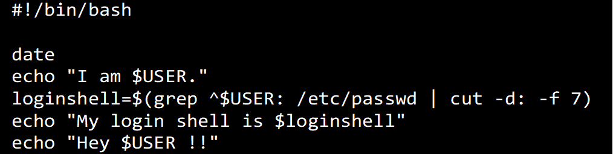

ブラウザでURLへアクセスしてください。
	https://github.com/sasakiy44/exercise02
## シェルスクリプト練習問題 01
1. viを使って添付の画像「sample01」のシェルスクリプトを作ってみましょう。
	
2. 1で作ったシェルスクリプトに実行属性を付加しましょう。
3. 標準出力のリダイレクトを使って1のシェルスクリプトの実行結果をファイル「result01」に出力しましょう。
4. 3で作ったファイル「result01」をtarコマンドを使ってtar+gz形式でアーカイブしましょう。なおファイル名は「出席番号_result01.tar.gz」としてください。
5. 4で作ったアーカイブをWindowsPCにファイル転送してクラスルームに提出しましょう。